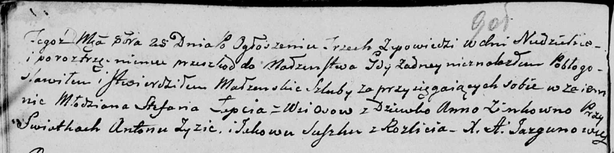

**Лапец (Зинк) Анна (Łapciowa (Zinkowa) Anna)**

25 октября 1803 г -- венчание с молодым Стефаном Лапцем с деревни Осово
(НИАБ 136-13-920, лист 9об, №6/1803-б (ориг)).

**НИАБ 136-13-920:** Лист 9об. **Метрическая запись №6/1803-б (ориг).**

Дедиловичская Покровская церковь. 25 октября 1803 года. Метрическая
запись о венчании.

Łapac Stefan -- жених, молодой, с деревни Осовo.

Zinkowna Anna -- невеста, девка.

Zyz Anton -- свидетель.

Suszko Jakow -- свидетель, с деревни Разлитье.

Jazgunowicz Antoni -- ксёндз.
