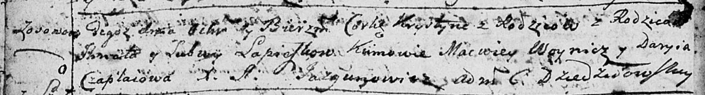

**Лепёшко Василь Игнатов (Lapieszka Wasil)**

25 апреля 1806 г -- крещение (НИАБ 136-13-894, лист 60, №18/1806-р
(ориг)).

**НИАБ 136-13-894:** Лист 60. **Метрическая запись №18/1806-р (ориг).**

{width="6.496527777777778in"
height="0.8300853018372704in"}

Дедиловичская Покровская церковь. 25 апреля 1806 года. Метрическая
запись о крещении.

Lapioszka Wasil -- сын родителей с деревни Осовo.

Lapioszka Jhnat -- отец.

Lapioszkowa Lubow -- мать.

Woynicz Macwiey -- кум.

Czaplaiowa Darya -- кума.

Jazgunowicz Antoni -- ксёндз.
