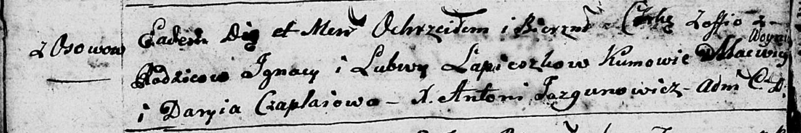
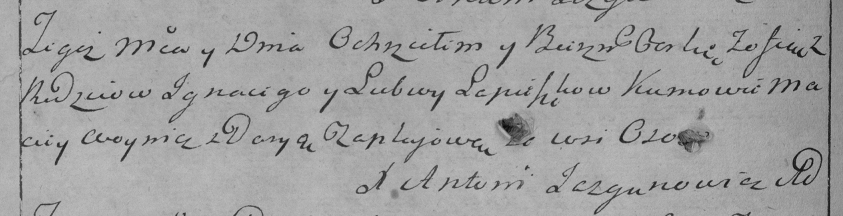

**Лепёшко Зофья Игнатова (Lapieszkowna Zofia)**

27 сентября 1797 г -- крещение (НИАБ 136-13-894, лист 34об, №57/1797-р
(ориг)), (РГИА 823-2-18, лист 260об, №38/1797-р (коп)).

**НИАБ 136-13-894:** Лист 34об. **Метрическая запись №57/1797-р
(ориг).**

Дедиловичская Покровская церковь. 27 сентября 1797 года. Метрическая
запись о крещении.

Lapioszkowna Zofia -- дочь родителей с деревни Осовo.

Lapioszka Jgnacy -- отец.

Lapioszkowa Lubow -- мать.

Woynicz Macwey - кум.

Czaplaiowa Daryia - кума.

Jazgunowicz Antoni -- ксёндз.

**РГИА 823-2-18:** Лист 260об. **Метрическая запись №38/1797-р (коп).**

Дедиловичская Покровская церковь. 27 августа 1797 года. Метрическая
запись о крещении.

Liapioszkowna Zofija -- дочь родителей с деревни Осово.

Liapioszka Jgnacy -- отец.

Liapioszkowa Lubow -- мать.

Woynicz Maciey -- кум.

Czaplajowa Darya -- кума.

Jazgunowicz Antoni -- ксёндз.
