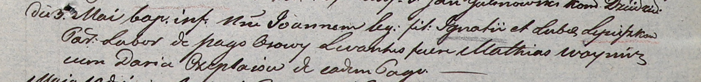

**Лепёшко Иоанн Игнатов (Lepieszka Joann)**

3 мая 1803 г -- крещение (НИАБ 937-4-32, лист 9, №11/1803-р).

**НИАБ 937-4-32:** Лист 9. **Метрическая запись №11/1803-р.**

{width="6.496527777777778in"
height="0.7666666666666667in"}

Дедиловичский костел Наисвятейшего Сердца Иисуса. 3 мая 1803 года.
Метрическая запись о крещении.

Lepieszka Joann -- сын крестьян с деревни Осово.

Lepieszka Jgnati -- отец.

Lepieszkowa Luba -- мать.

Woynicz Mathias -- крестный отец.

Czeplaiowa Daria -- крестная мать, с деревни Осово.

Galinowski Joann -- ксёндз, комендант Дедиловичского костела.
