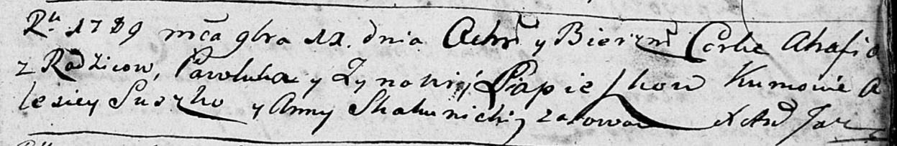
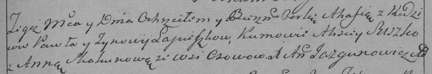

**Лепёшко Агафия Павлова (Lapieszkowna Ahafia)**

11 ноября 1789 г -- крещение дочери Агафии (НИАБ 136-13-894, лист 8,
№59/1789-р (ориг)), (РГИА 823-2-18, лист 239, №28/1789-р (коп)).

**НИАБ 136-13-894:** Лист 8. **Метрическая запись №59/1789-р (ориг).**

Дедиловичская Покровская церковь. 11 ноября 1789 года. Метрическая
запись о крещении.

Lapieszkowna Ahafia -- дочь родителей с деревни Осово.

Lapieszko Pawluk -- отец.

Lapieszkowa Zynowija -- мать.

Suszko Alesiey - кум.

Skakunicha Anna - кума.

Jazgunowicz Antoni -- ксёндз.

**РГИА 823-2-18:** Лист 239. **Метрическая запись №28/1789-р (коп).**

Дедиловичская Покровская церковь. 11 ноября 1789 года. Метрическая
запись о крещении.

Łapieszkowna Ahafia -- дочь родителей с деревни Осово.

Łapieszka Paweł -- отец.

Łapieszkowa Zynowija -- мать.

Suszko Alisiey -- кум.

Skakunowa Anna - кума.

Jazgunowicz Antoni -- ксёндз.
