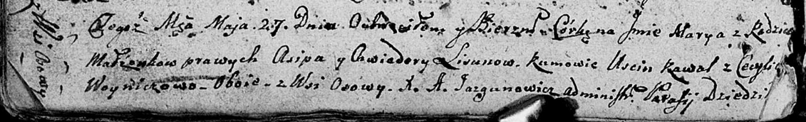

**Лесун Асип (Lisun Osip)**

27 мая 1807 г -- крещение дочери Марыи (НИАБ 136-13-894, лист 62об,
№27/1807-р (ориг)).

**НИАБ 136-13-894:** Лист 62об. **Метрическая запись №27/1807-р
(ориг).**

Дедиловичская Покровская церковь. 27 мая 1807 года. Метрическая запись о
крещении.

Lisunowna Marya -- дочь родителей с деревни Осово.

Lisun Asip -- отец.

Lisunowa Chwiedora -- мать.

Kawal Uscin -- кум, с деревни Осово.

Woyniczowa Cecylia -- кума, с деревни Осово.

Jazgunowicz Antoni -- ксёндз.
