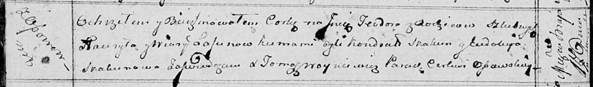

**Лесун Гаврыла (Lasun Hauryła)**

17 мая 1814 г -- крещение дочери Тодоры (НИАБ 136-13-894, лист 89об,
№32/1814-р (ориг)).

**НИАБ 136-13-894:** Лист 89об. **Метрическая запись №32/1814-р
(ориг).**

Осовская Покровская церковь. 17 мая 1814 года. Метрическая запись о
крещении.

Lasunowna Teodora -- дочь родителей с деревни Осовo.

Lasun Hauryła -- отец.

Lasunowa Wiara -- мать.

Skakun Kondrat -- кум.

Skakunowa Eudokija -- кума.

Woyniewicz Tomasz -- ксёндз.
