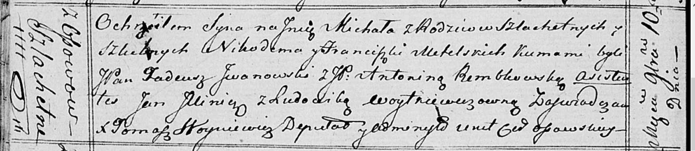

**Метельский Никодим, шляхтич (Metelski Nikodim)**

10 ноября 1818 г -- крещение сына Михала (НИАБ 136-13-894, лист 99об,
№38/1818-р (ориг)).

**НИАБ 136-13-894:** Лист 99об. **Метрическая запись №38/1818-р
(ориг).**

Осовская Покровская церковь. 10 ноября 1818 года. Метрическая запись о
крещении.

Metelski Michał, JP -- сын родителей с деревни Осово, шляхтич.

Metelski Nikodim, JP -- отец, шляхтич.

Metelska Franciszka, JP -- мать, шляхтянка.

Jwanjwski Tadeusz, JP -- кум, шляхтич.

Rembkowska Antonina, JP -- кума, шляхтянка.

Jllinicz Jan -- ассистент.

Woitkiewiczowna Ludowika -- ассистентка.

Woyniewicz Tomasz -- ксёндз.
