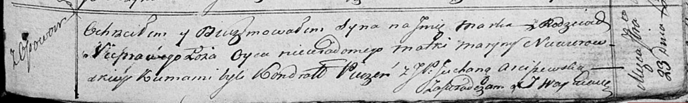

**Неверовская Марына (Newerowska Maryna)**

23 сентября 1817 г -- крещение незаконнорожденного сына Марка (НИАБ
136-13-894, лист 97, №57/1817-р (ориг)).

**НИАБ 136-13-894:** Лист 97. **Метрическая запись №57/1817-р (ориг).**

Осовская Покровская церковь. 23 сентября 1817 года. Метрическая запись о
крещении.

Marko -- незаконнорожденный сын с деревни Осовo.

Niewerowska Maryna -- мать.

Pieczeń Kondrat -- кум.

Arciszewska Juchana, JP -- кума, шляхтянка.

Woyniewicz Tomasz -- ксёндз.
