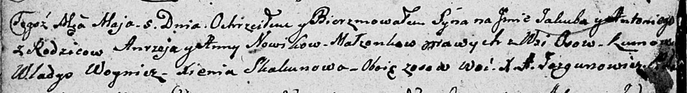

**Новик Игнат (Nowik Andrzey)**

5 мая 1807 г -- крещение сына Якуба Антона (НИАБ 136-13-894, лист 62об,
№23/1807-р (ориг)).

**НИАБ 136-13-894:** Лист 62об. **Метрическая запись №23/1807-р
(ориг).**

Дедиловичская Покровская церковь. 5 мая 1807 года. Метрическая запись о
крещении.

Nowik Jakub Antonij -- сын родителей с деревни Осовo.

Nowik Andrzey -- отец.

Nowikowa Anna -- мать.

Woynicz Władyś -- кум, с деревни Осовo.

Skakunowa Xienia -- кума, с деревни Осовo.

Jazgunowicz Antoni -- ксёндз.
