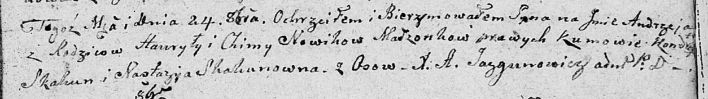

**Новик Андрей Гаврилов (Nowik Andrzey)**

24 октября 1809 г -- крещение (НИАБ 136-13-894, лист 76, №58/1809-р
(ориг)).

**НИАБ 136-13-894:** Лист 76. **Метрическая запись №58/1809-р (ориг).**

Дедиловичская Покровская церковь. 24 октября 1809 года. Метрическая
запись о крещении.

Nowik Andrzey -- сын родителей из деревни Осовo.

Nowik Hauryła -- отец.

Nowikowa Chima -- мать.

Skakun Kondrat -- кум.

Skakunowna Nastazya -- кума.

Jazgunowicz Antoni -- ксёндз.
