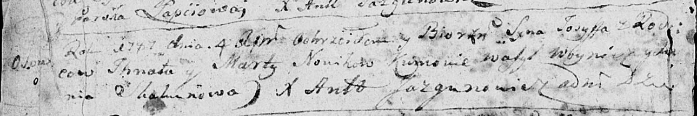

**Новик Марта (Nowik Marta)**

4 апреля 1787 г -- крещение сына Иосифа (НИАБ 136-13-894, лист 1об,
№13/1787-р (ориг)).

**НИАБ 136-13-894:** Лист 1об. **Метрическая запись №13/1787-р (ориг).**

{width="6.496527777777778in"
height="1.0889009186351706in"}

Дедиловичская Покровская церковь. 4 апреля 1787 года. Метрическая запись
о крещении.

Nowik Josyff -- сын родителей с деревни Осово.

Nowik Jhnat -- отец.

Nowikowa Marta -- мать.

Woynicz Wasyl - кум.

Skakunowa Xienia - кума.

Jazgunowicz Antoniusz -- ксёндз.
