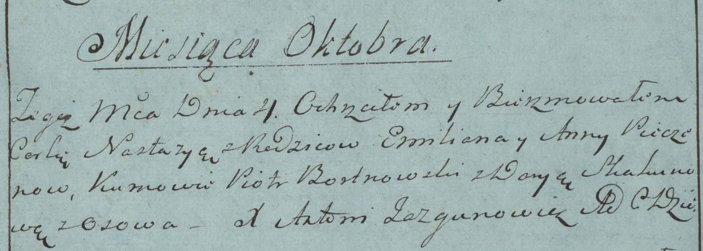

**Печень Анна (Peczeniowa Anna)**

4 октября 1783 г -- крещение дочери Настасья (РГИА 823-2-18, лист 225,
№24/1783-р (коп)).

**РГИА 823-2-18:** Лист 225. **Метрическая запись №24/1783-р (коп).**

Дедиловичская Покровская церковь. 4 октября 1783 года. Метрическая
запись о крещении.

Pieczeniowna Nastazya -- дочь родителей с деревни Осово.

Pieczeń Emilian -- отец.

Pieczeniowa Anna -- мать.

Bortnowski Piotr -- кум.

Skakunowa Darya - кума.

Jazgunowicz Antoni -- ксёндз.
