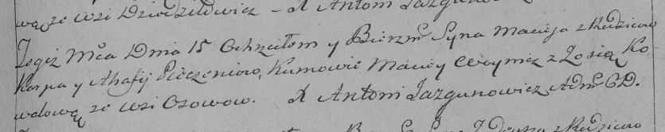

**Печень Мацей Карпов (Pieczeń Maciey)**

15 августа 1793 г -- крещение (НИАБ 136-13-894, лист 20, №61/1793-р
(ориг)), (РГИА 823-2-18, лист 248, №33/1793-р (коп)).

**НИАБ 136-13-894:** Лист 20. **Метрическая запись №61/1793-р (ориг).**

Дедиловичская Покровская церковь. 15 августа 1793 года. Метрическая
запись о крещении.

Pieczeń Maciey -- сын родителей с деревни Осовo.

Pieczeń Karp -- отец.

Pieczeniowa Ahafija -- мать.

Woynicz Macwey - кум.

Kowalowa Zosia - кума.

Jazgunowicz Antoni -- ксёндз.

**РГИА 823-2-18:** Лист 248. **Метрическая запись №33/1793-р (коп).**

Дедиловичская Покровская церковь. 15 августа 1793 года. Метрическая
запись о крещении.

Pieczeń Maciey -- сын родителей с деревни Осово.

Pieczeń Karp -- отец.

Pieczeniowa Ahafija -- мать.

Woynicz Maciey -- кум.

Kowalowa Zosia -- кума.

Jazgunowicz Antoni -- ксёндз.
