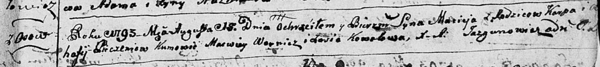

**Печень Роман Карпов (Pieczeń Roman)**

27 июля 1784 г -- крещение (РГИА 823-2-18, лист 227, №15/1784-р (коп)).

**РГИА 823-2-18.** Лист 227. **Метрическая запись №15/1784-р (коп).**

{width="6.496527777777778in"
height="1.5930555555555554in"}

Дедиловичская Покровская церковь. 27 июля 1784 года. Метрическая запись
о крещении.

Pieczań Roman -- сын родителей с деревни Осово.

Pieczań Karp -- отец.

Pieczaniowa Ahapa -- мать.

Woynicz Macwiey -- кум.

Kowalowa Zofia - кума.

Jazgunowicz Antoni -- ксёндз.
