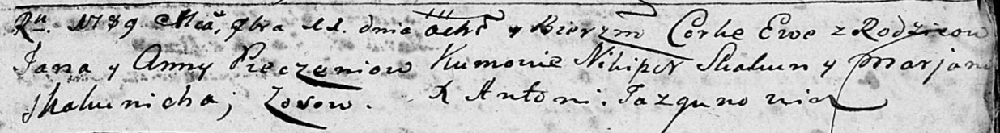

**Печень Ева Кондратова (Pieczaniowna Ewa)**

11 ноября 1789 г -- крещение (НИАБ 136-13-894, лист 8, №58/1789-р
(ориг)).

**НИАБ 136-13-894:** Лист 8. **Метрическая запись №58/1789-р (ориг).**

Дедиловичская Покровская церковь. 11 ноября 1789 года. Метрическая
запись о крещении.

Pieczaniowna Ewa -- дочь родителей с деревни Осово.

Pieczań Jan -- отец.

Pieczaniowa Anna -- мать.

Skakun Nikiper - кум.

Skakunicha Marjana - кума.

Jazgunowicz Antoni -- ксёндз.
