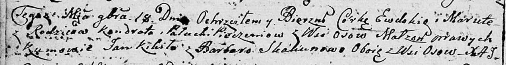

**Печень Евдокия Кондратова (Pieczaniowna Ewdokia Maruta)**

18 ноября 1806 г -- крещение дочери Евдокии Маруты (НИАБ 136-13-894,
лист 61об, №51/1806-р (ориг)).

**НИАБ 136-13-894:** Лист 61об. **Метрическая запись №51/1806-р
(ориг).**

Дедиловичская Покровская церковь. 18 ноября 1806 года. Метрическая
запись о крещении.

Pieczaniowna Ewdokia Maruta -- дочь родителей с деревни Осовo.

Pieczań Kondrat -- отец.

Pieczaniowa Palucha -- мать.

Kikiło Jan -- кум, с деревни Осовo.

Skakunowa Barbara -- кума, с деревни Осовo.

Jazgunowicz Antoni -- ксёндз.

**НИАБ 136-13-894:** Лист 61об. **Метрическая запись №51/1806-р
(ориг).**

Дедиловичская Покровская церковь. 18 ноября 1806 года. Метрическая
запись о крещении.

Pieczaniowna Ewdokia Maruta -- дочь родителей с деревни Осовo.

Pieczań Kondrat -- отец.

Pieczaniowa Palucha -- мать.

Kikiło Jan -- кум, с деревни Осовo.

Skakunowa Barbara -- кума, с деревни Осовo.

Jazgunowicz Antoni -- ксёндз.
