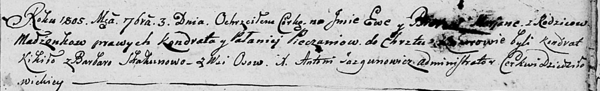

**Печень Илья Кондратов (Pieczań Eliasz)**

19 июля 1814 г -- крещение (НИАБ 136-13-894, лист 90, №42/1814-р
(ориг)).

Лист 90. **Метрическая запись №42/1814-р (ориг).**

{width="6.496527777777778in"
height="0.7482841207349081in"}

Осовская Покровская церковь. 19 июля 1814 года. Метрическая запись о
крещении.

Pieczań Eliasz -- сын родителей с деревни Осовo.

Pieczań Kondrat -- отец.

Pieczaniowa Polonija -- мать.

Kikiło Jan -- кум.

Skakunowa Barbara -- кума.

Woyniewicz Tomasz -- ксёндз.
