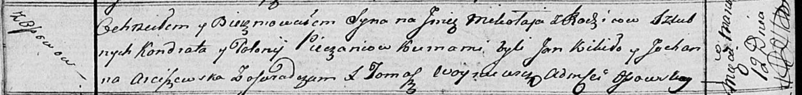

**Печень Миколай Кондратов (Pieczań Mikołay)**

12 марта 1817 г -- крещение (НИАБ 136-13-894, лист 95об, №17/1817-р
(ориг)).

**НИАБ 136-13-894:** Лист 95об. **Метрическая запись №17/1817-р
(ориг).**

Осовская Покровская церковь. 12 марта 1817 года. Метрическая запись о
крещении.

Pieczań Mikołay -- сын родителей с деревни Осовo.

Pieczań Kondrat -- отец.

Pieczaniowa Połonieja -- мать.

Kikiło Jan -- кум.

Arciszewska Juchanna -- кума.

Woyniewicz Tomasz -- ксёндз.
