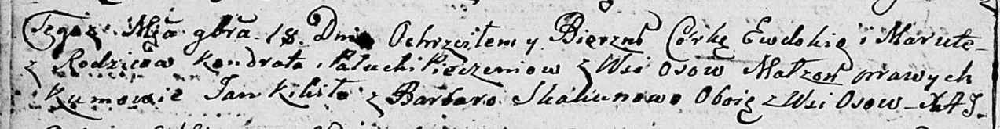
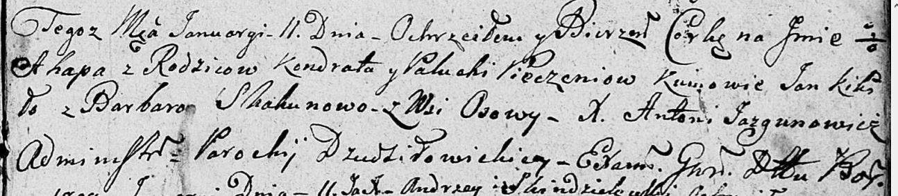
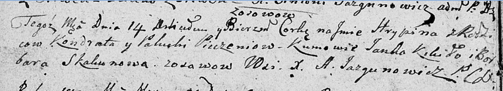
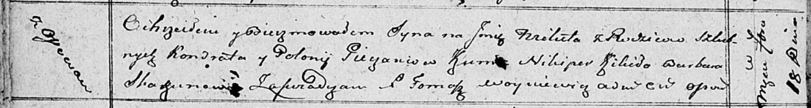
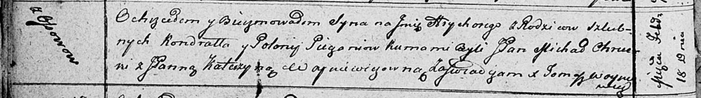
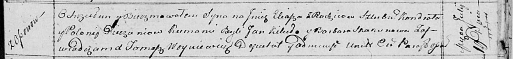
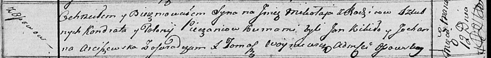
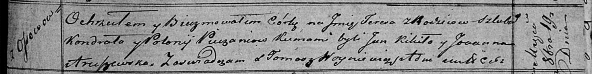
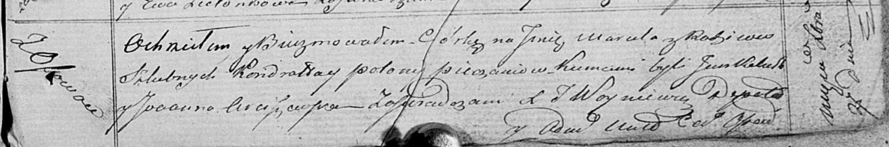

**Печень Паланея, Полония (Pieczaniowa Pałanieja, Palucha, Połonia)**

3 сентября 1805 г -- крещение дочери Евы Марьяны (НИАБ 136-13-894, лист
58, №39/1805-р (ориг)).

18 ноября 1806 г -- крещение дочери Евдокии Маруты (НИАБ 136-13-894,
лист 61об, №51/1806-р (ориг)).

11 января 1808 г -- крещение дочери Агапы (НИАБ 136-13-894, лист 64,
№3/1808-р (ориг)).

14 марта 1809 г -- крещение дочери Грыпины (НИАБ 136-13-894, лист 73об,
№9/1809-р (ориг)).

18 сентября 1810 г -- крещение сына Микиты (НИАБ 136-13-894, лист 78об,
№38/1810-р (ориг)).

18 февраля 1812 г -- крещение сына Грыгорыя (НИАБ 136-13-894, лист 83об,
№13/1812-р (ориг)).

19 июля 1814 г -- крещение сына Ильи (НИАБ 136-13-894, лист 90,
№42/1814-р (ориг)).

12 марта 1817 г -- крещение сына Миколая (НИАБ 136-13-894, лист 95об,
№17/1817-р (ориг)).

14 июля 1818 г -- крещение дочери Татьяны (НИАБ 136-13-894, лист 98об,
№22/1818-р (ориг)).

19 октября 1819 г -- крещение дочери Тересы (НИАБ 136-13-894, лист 103,
№55/1819-р (ориг)).

27 декабря 1820 г -- крещение дочери Маруты (НИАБ 136-13-894, лист 105,
№46/1820-р (ориг)).

**НИАБ 136-13-894:** Лист 61об. **Метрическая запись №51/1806-р
(ориг).**

Дедиловичская Покровская церковь. 18 ноября 1806 года. Метрическая
запись о крещении.

Pieczaniowna Ewdokia Maruta -- дочь родителей с деревни Осовo.

Pieczań Kondrat -- отец.

Pieczaniowa Palucha -- мать.

Kikiło Jan -- кум, с деревни Осовo.

Skakunowa Barbara -- кума, с деревни Осовo.

Jazgunowicz Antoni -- ксёндз.

**НИАБ 136-13-894:** Лист 61об. **Метрическая запись №51/1806-р
(ориг).**

Дедиловичская Покровская церковь. 18 ноября 1806 года. Метрическая
запись о крещении.

Pieczaniowna Ewdokia Maruta -- дочь родителей с деревни Осовo.

Pieczań Kondrat -- отец.

Pieczaniowa Palucha -- мать.

Kikiło Jan -- кум, с деревни Осовo.

Skakunowa Barbara -- кума, с деревни Осовo.

Jazgunowicz Antoni -- ксёндз.

**НИАБ 136-13-894:** Лист 64. **Метрическая запись №3/1808-р (ориг).**

Дедиловичская Покровская церковь. 11 января 1808 года. Метрическая
запись о крещении.

Pieczeniowna Ahapa -- дочь родителей с деревни Осовo.

Pieczeń Kondrat -- отец.

Pieczeniowa Palucha -- мать.

Kikiło Jan -- кум.

Skakunowa Barbara -- кума.

Jazgunowicz Antoni -- ксёндз.

**НИАБ 136-13-894:** Лист 73об. **Метрическая запись №9/1809-р (ориг).**

Дедиловичская Покровская церковь. 14 марта 1809 года. Метрическая запись
о крещении.

Pieczeniowna Hrypina -- дочь родителей с деревни Осовo.

Pieczań Kondrat -- отец.

Pieczeniowa Palucha -- мать.

Kikiło Janka -- кум.

Skakunowa Barbara -- кума.

Jazgunowicz Antoni -- ксёндз.

**НИАБ 136-13-894:** Лист 78об. **Метрическая запись №38/1810-р
(ориг).**

Осовская Покровская церковь. 18 сентября 1810 года. Метрическая запись о
крещении.

Pieczań Mikita -- сын родителей с деревни Осовo.

Pieczań Kondrat -- отец.

Pieczaniowa Połonia -- мать.

Kikiło Nikiper -- кум.

Skakunowa Barbara -- кума.

Woyniewicz Tomasz -- ксёндз.

**НИАБ 136-13-894:** Лист 83об. **Метрическая запись №13/1812-р
(ориг).**

Осовская Покровская церковь. 18 февраля 1812 года. Метрическая запись о
крещении.

Pieczań Hryhory -- сын родителей с деревни Осово.

Pieczań Kondrat -- отец.

Pieczaniowa Polonija -- мать.

Chrucki Michal, JP -- кум, шляхтич.

Woyniewiczowna Katerzyna, JP -- кума, шляхтянка.

Woyniewicz Tomasz -- ксёндз.

Лист 90. **Метрическая запись №42/1814-р (ориг).**

Осовская Покровская церковь. 19 июля 1814 года. Метрическая запись о
крещении.

Pieczań Eliasz -- сын родителей с деревни Осовo.

Pieczań Kondrat -- отец.

Pieczaniowa Polonija -- мать.

Kikiło Jan -- кум.

Skakunowa Barbara -- кума.

Woyniewicz Tomasz -- ксёндз.

**НИАБ 136-13-894:** Лист 95об. **Метрическая запись №17/1817-р
(ориг).**

Осовская Покровская церковь. 12 марта 1817 года. Метрическая запись о
крещении.

Pieczań Mikołay -- сын родителей с деревни Осовo.

Pieczań Kondrat -- отец.

Pieczaniowa Połonieja -- мать.

Kikiło Jan -- кум.

Arciszewska Juchanna -- кума.

Woyniewicz Tomasz -- ксёндз.

**НИАБ 136-13-894:** Лист 98об. **Метрическая запись №22/1818-р
(ориг).**

Осовская Покровская церковь. 14 июля 1818 года. Метрическая запись о
крещении.

Pieczaniowna Taciana -- дочь родителей с деревни Осовo.

Pieczań Kondrat -- отец.

Pieczaniowa Połonija -- мать.

Kikiło Jan -- кум.

Araszewska Joanna -- кума.

Woyniewicz Tomasz -- ксёндз.

**НИАБ 136-13-894:** Лист 103. **Метрическая запись №55/1819-р (ориг).**

Осовская Покровская церковь. 19 октября 1819 года. Метрическая запись о
крещении.

Pieczaniowa Teresa -- дочь родителей с деревни Осовo.

Pieczań Kondrat -- отец.

Pieczaniowa Połonija -- мать.

Kikiło Jan -- кум.

Arciszewska Joanna -- кума.

**НИАБ 136-13-894:** Лист 105. **Метрическая запись №46/1820-р (ориг).**

Осовская Покровская церковь. 27 декабря 1820 года. Метрическая запись о
крещении.

Pieczaniowna Maruta -- дочь законных супругов, деревня Осовo.

Pieczań Kondrat -- отец.

Pieczaniowa Połonija -- мать.

Kal\... Jan -- кум.

Arciszewska Joanna -- кума.

Woyniewicz Tomasz -- ксёндз.
