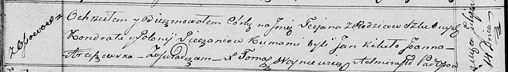

**Печень Татьяна Кондратова (Pieczaniowna Taciana)**

14 июля 1818 г -- крещение (НИАБ 136-13-894, лист 98об, №22/1818-р
(ориг)).

**НИАБ 136-13-894:** Лист 98об. **Метрическая запись №22/1818-р
(ориг).**

{width="6.496527777777778in"
height="0.9320024059492563in"}

Осовская Покровская церковь. 14 июля 1818 года. Метрическая запись о
крещении.

Pieczaniowna Taciana -- дочь родителей с деревни Осовo.

Pieczań Kondrat -- отец.

Pieczaniowa Połonija -- мать.

Kikiło Jan -- кум.

Araszewska Joanna -- кума.

Woyniewicz Tomasz -- ксёндз.
