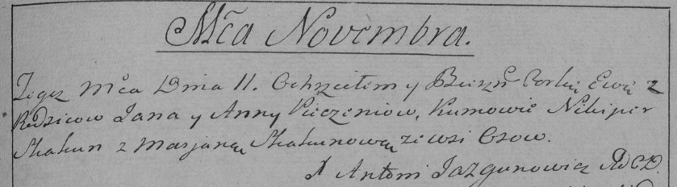

**Печень Ян (Pieczań Jan)**

11 ноября 1789 г -- крещение дочери Евы (НИАБ 136-13-894, лист 8,
№58/1789-р (ориг)), (РГИА 823-2-18, лист 239, №27/1789-р (коп)).

**НИАБ 136-13-894:** Лист 8. **Метрическая запись №58/1789-р (ориг).**

{width="6.496527777777778in"
height="0.8676345144356955in"}

Дедиловичская Покровская церковь. 11 ноября 1789 года. Метрическая
запись о крещении.

Pieczaniowna Ewa -- дочь родителей с деревни Осово.

Pieczań Jan -- отец.

Pieczaniowa Anna -- мать.

Skakun Nikiper - кум.

Skakunicha Marjana - кума.

Jazgunowicz Antoni -- ксёндз.

**РГИА 823-2-18:** Лист 239. **Метрическая запись №27/1789-р (коп).**

{width="6.496527777777778in"
height="1.7965277777777777in"}

Дедиловичская Покровская церковь. 11 ноября 1789 года. Метрическая
запись о крещении.

Pieczeniowna Ewa -- дочь родителей с деревни Осово.

Pieczań Jan -- отец.

Pieczeniowa Anna -- мать.

Skakun Nikiper -- кум.

Skakunowa Marjana - кума.

Jazgunowicz Antoni -- ксёндз.
