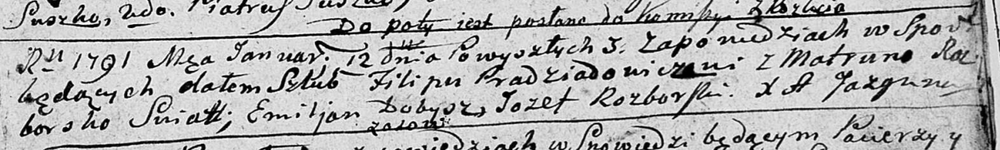

**Прадедович Филип (Pradziadowicz Filip)**

12 января 1791 г -- венчание с Матруной Розборской с деревни Осово (НИАБ
136-13-894, лист 69, №11/1791-б (коп)).

**НИАБ 136-13-894:** Лист 69. **Метрическая запись №1/1791-б (ориг).**

Дедиловичская Покровская церковь. 12 января 1791 года. Метрическая
запись о венчании.

Pradziadowicz Filip -- жених.

Rozborska Matruna -- невеста, с деревни Осово.

Dobysz Emiljan -- свидетель.

Rozborski Jozef -- свидетель.

Jazgunowicz Antoni -- ксёндз.
