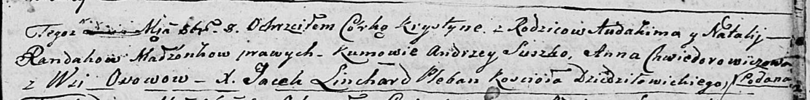

**Рандак Аудаким (Randak Audakim)**

2 октября 1805 г -- крещение дочери Крыстыны (НИАБ 136-13-894, лист 58,
№40/1803-р (ориг)).

**НИАБ 136-13-894:** Лист 58. **Метрическая запись №40/1805-р (ориг).**

Дедиловичская Покровская церковь. 8 октября 1805 года. Метрическая
запись о крещении.

Randakowna Krystyna -- дочь родителей с деревни Осовo.

Randak Audakim -- отец.

Randakowa Natalija -- мать.

Suszko Andrzey -- кум.

Chwiedorowiczowa Anna -- кума.

Linchard Jacek -- ксёндз.
