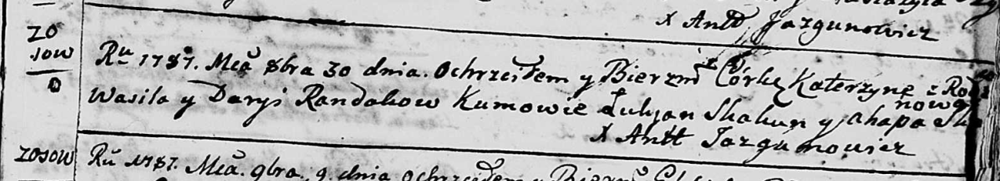

**Рандак Василь (Randak Wasil)**

30 октября 1787 г -- крещение дочери Катерины (НИАБ 136-13-894, лист 3,
№55/1787-р (ориг)).

**НИАБ 136-13-894:** Лист 3. **Метрическая запись №55/1787-р (ориг).**

Дедиловичская Покровская церковь. 30 октября 1787 года. Метрическая
запись о крещении.

Randakowna Katerzyna -- дочь родителей с деревни Осово.

Randak Wasil -- отец.

Randakowa Daryia -- мать.

Skakun Łukjan - кум.

Skakunowa Ahapa - кума.

Jazgunowicz Antoni -- ксёндз.
