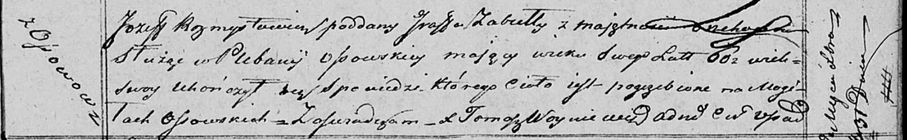

**Розмыслович Иосиф (Rozmysłowicz Jozef)**

31 декабря 1819 г -- отпевание, умер в возрасте 60 лет (родился около
1759 г) (НИАБ 136-13-919, лист 33, №10/1819-у (ориг)).

**НИАБ 136-13-919:** Лист 33. **Метрическая запись №10/1819-у (ориг).**

Осовская униатская церковь. 31 декабря 1819 года. Метрическая запись об
отпевании.

Rozmysłowicz Jozef -- умерший, подданный графа Забеллы с имения ? служил
в плебании Осовской, 60 лет, похоронен на кладбище деревни Осово.

Woyniewicz Tomasz -- ксёндз.
