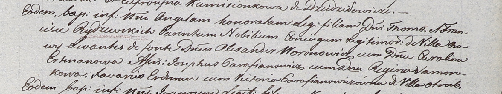

**Рыдзевская Ангеля Томашова (Rydzewska Angela Honorata)**

22 февраля 1803 г -- крещение (НИАБ 937-4-32, лист 9, №4/1803-р).

**НИАБ 937-4-32:** Лист 9. **Метрическая запись №4/1803-р.**

Дедиловичский костел Наисвятейшего Сердца Иисуса. 22 февраля 1803 года.
Метрическая запись о крещении.

Rydzewska Angela Honorata -- дочь шляхтичей с деревни Осово.

Rydzewski Thoma -- отец.

Rydzewska Francisca -- мать.

Woronowicz Alexander -- крестный отец, шляхтич.

Ertmanowa Carolina -- крестная мать, шляхтянка.

Parafianowicz Josephus - ассистент, шляхтич.

Somorokowa Regina - ассистентка, шляхтянка.

Erdman Xavari -- ассистент.

Parafianowiczowna Victoria -- ассистентка, с деревни Отруб.

Linhart Hyacinthus -- ксёндз.
