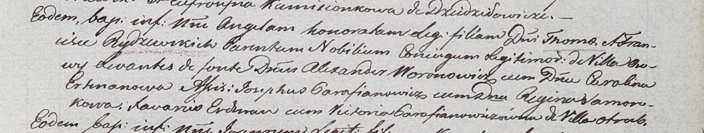

**Рыдзевский Тома, шляхтич (Rydzewski Thoma)**

27 февраля 1799 г -- венчание с шляхтянкой Францишкой Арцишевской (НИАБ
1781-27-199, лист 126, №5/1799-б).

22 февраля 1803 г -- крещение дочери Ангели Гонораты (НИАБ 937-4-32,
лист 9, №4/1803-р).

**НИАБ 1781-27-199:** Лист 126. **Метрическая запись №5/1799-б.**

Дедиловичский костел Наисвятейшего Сердца Иисуса. 27 февраля 1799 года.
Метрическая запись о венчании.

Rydzewski Thoma -- жених, шляхтич, с деревни Осово.

Arciszewska Francisca -- невеста, шляхтянка.

Erdmann Xaveri -- свидетель, шляхтич.

Abramowicz Andrei -- свидетель, шляхтич.

Linhart Hyacinthus -- ксёндз.

**НИАБ 937-4-32:** Лист 9. **Метрическая запись №4/1803-р.**

Дедиловичский костел Наисвятейшего Сердца Иисуса. 22 февраля 1803 года.
Метрическая запись о крещении.

Rydzewska Angela Honorata -- дочь шляхтичей с деревни Осово.

Rydzewski Thoma -- отец.

Rydzewska Francisca -- мать.

Woronowicz Alexander -- крестный отец, шляхтич.

Ertmanowa Carolina -- крестная мать, шляхтянка.

Parafianowicz Josephus - ассистент, шляхтич.

Somorokowa Regina - ассистентка, шляхтянка.

Erdman Xavari -- ассистент.

Parafianowiczowna Victoria -- ассистентка, с деревни Отруб.

Linhart Hyacinthus -- ксёндз.
