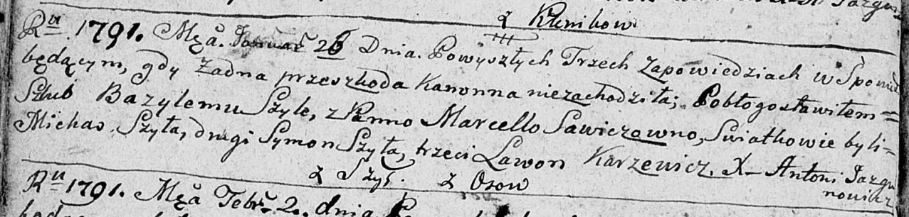

**Савич (Шило) Марцелла (Szyłowa Marcella z Sawiczow)**

26 января 1791 г -- венчание с Базылём Шилой с деревни Шилы с деревни
Шилы (НИАБ 136-13-894, лист 69об, №6/1791-б (ориг)).

**НИАБ 136-13-894:** Лист 69об. **Метрическая запись №6/1791-б (ориг).**

{width="6.496527777777778in"
height="1.556913823272091in"}

Дедиловичская Покровская церковь. 26 января 1791 года. Метрическая
запись о венчании.

Szyło Bazyli -- жених, с деревни Шилы.

Sawiczowna Marcella -- невеста, с деревни Осовo.

Szyło Michaś -- свидетель.

Szyło Symon -- свидетель.

Karżewicz Lawon -- свидетель.

Jazgunowicz Antoni -- ксёндз.
