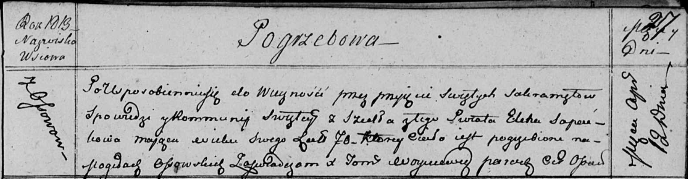

**Сапатько Елена (Sapaćkowa Elena)**

12 апреля 1813 г -- отпевание, умерла в возрасте 70 лет (родилась около
1743 г) (НИАБ 136-13-919, лист 27, №37/1813-у (ориг)).

**НИАБ 136-13-894:** Лист 27. **Метрическая запись №37/1813-у (ориг).**

Осовская униатская церковь. 12 апреля 1813 года. Метрическая запись об
отпевании.

Sapaćkowa Elena -- умершая, 70 лет, с деревни Осово, похоронена на
кладбище деревни Осово.

Woyniewicz Tomasz -- ксёндз.
