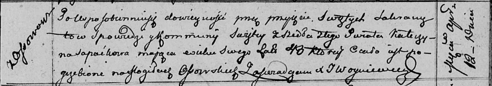

**Сапатько Катерына (Sapaćkowa Katerzyna)**

12 апреля 1813 г -- отпевание, умерла в возрасте 40 лет (родилась около
1773 г) (НИАБ 136-13-919, лист 27, №38/1813-у (ориг)).

**НИАБ 136-13-894:** Лист 27. **Метрическая запись №38/1813-у (ориг).**

{width="6.496527777777778in"
height="1.1395833333333334in"}

Осовская униатская церковь. 12 апреля 1813 года. Метрическая запись об
отпевании.

Sapaćkowa Katerzyna -- умершая, 40 лет, с деревни Осово, похоронена на
кладбище деревни Осово.

Woyniewicz Tomasz -- ксёндз.
