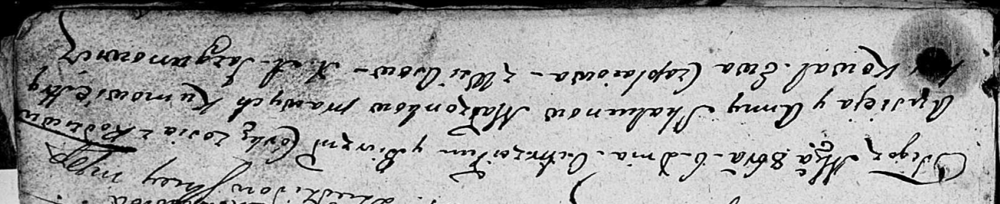

**Скакун Зося Авсеева (Skakunowna Zosia)**

6 октября 1808 г -- крещение дочери Зоси (НИАБ 136-13-894, лист 72,
№33/1808-р (ориг)).

**НИАБ 136-13-894:** Лист 72. **Метрическая запись №33/1808-р (ориг).**

Дедиловичская Покровская церковь. 6 октября 1808 года. Метрическая
запись о крещении.

Skakunowna Zosia -- дочь родителей с деревни Осово.

Skakun Ausiey -- отец.

Skakunowa Anna -- мать.

Kawal Hryhor -- кум.

Czaplaiowa Ewa -- кума.
