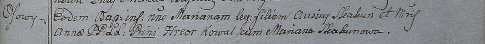

**Скакун Марьяна Авсеева (Skakunowna Mariana)**

28 ноября 1798 г -- крещение дочери Марьяны (НИАБ 1781-27-199, лист 123,
№18/1798-р).

**НИАБ 1781-27-199:** Лист 123. **Метрическая запись №18/1798-р.**

Дедиловичский костел Наисвятейшего Сердца Иисуса. 28 ноября 1798 года.
Метрическая запись о крещении.

Skakunowna Mariana -- дочь крестьян с деревни Осово.

Skakun Ausiey -- отец.

Skakunowa Anna -- мать.

Kowal Hreor -- крестный отец.

Skakunowa Mariana - крестная мать.

Linhart Hyacinthus -- ксёндз.
