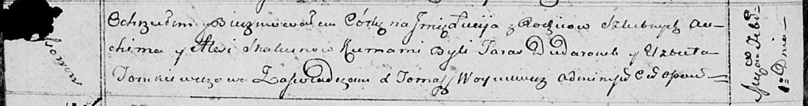
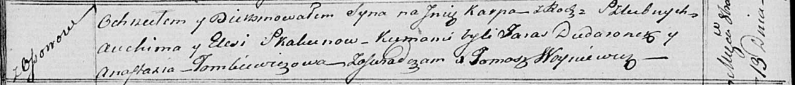
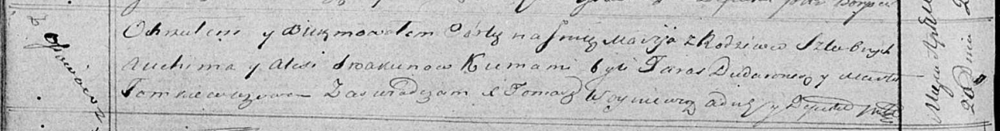

**Скакун Авхим (Skakun Auchim)**

1 февраля 1814 г -- крещение дочери Люции (НИАБ 136-13-894, лист 88об,
№7/1814-р (ориг)).

19 октября 1817 г -- крещение сына Карпа (НИАБ 136-13-894, лист 97об,
№61/1817-р (ориг)).

20 апреля 1819 г -- крещение дочери Марии (НИАБ 136-13-894, лист 100об,
№21/1819-р (ориг)).

**НИАБ 136-13-894:** Лист 88об. **Метрическая запись №7/1814-р (ориг).**

Осовская Покровская церковь. 1 февраля 1814 года. Метрическая запись о
крещении.

Skakunowna Lucija -- дочь родителей с деревни Осовo.

Skakun Auchim -- отец.

Skakunowa Alesia -- мать.

Dudaronek Taras -- кум.

Tomkiewiczowa Elżbieta -- кума.

Woyniewicz Tomasz -- ксёндз.

**НИАБ 136-13-894:** Лист 97об. **Метрическая запись №61/1817-р
(ориг).**

Осовская Покровская церковь. 19 октября 1817 года. Метрическая запись о
крещении.

Skakun Karp -- сын родителей с деревни Осовo.

Skakun Auchim -- отец.

Skakunowa Elesia -- мать.

Dudaronek Taras -- кум.

Tomkiewiczowa Anastazia -- кума.

Woyniewicz Tomasz -- ксёндз.

**НИАБ 136-13-894:** Лист 100об. **Метрическая запись №21/1819-р
(ориг).**

Осовская Покровская церковь. 20 апреля 1819 года. Метрическая запись о
крещении.

Skakunowna Marija -- дочь родителей с деревни Осовo.

Skakun Auchim -- отец.

Skakunowa Aliesia -- мать.

Dudaronek Taras -- кум.

Tomkiewiczowa Marta -- кума.

Woyniewicz Tomasz -- ксёндз.
