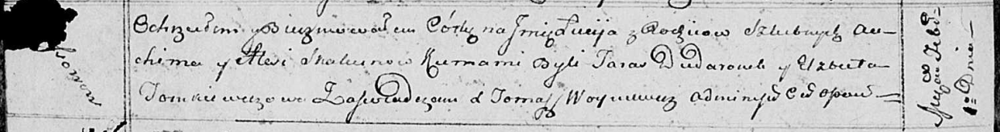

**Скакун Люция Авхимова (Skakunowna Lucija)**

1 февраля 1814 г -- крещение (НИАБ 136-13-894, лист 88об, №7/1814-р
(ориг)).

**НИАБ 136-13-894:** Лист 88об. **Метрическая запись №7/1814-р (ориг).**

{width="6.496527777777778in"
height="0.8595877077865267in"}

Осовская Покровская церковь. 1 февраля 1814 года. Метрическая запись о
крещении.

Skakunowna Lucija -- дочь родителей с деревни Осовo.

Skakun Auchim -- отец.

Skakunowa Alesia -- мать.

Dudaronek Taras -- кум.

Tomkiewiczowa Elżbieta -- кума.

Woyniewicz Tomasz -- ксёндз.
