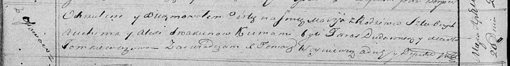

**Скакун Мария Авхимова (Skakunowna Marija)**

20 апреля 1819 г -- крещение (НИАБ 136-13-894, лист 100об, №21/1819-р
(ориг)).

**НИАБ 136-13-894:** Лист 100об. **Метрическая запись №21/1819-р
(ориг).**

Осовская Покровская церковь. 20 апреля 1819 года. Метрическая запись о
крещении.

Skakunowna Marija -- дочь родителей с деревни Осовo.

Skakun Auchim -- отец.

Skakunowa Aliesia -- мать.

Dudaronek Taras -- кум.

Tomkiewiczowa Marta -- кума.

Woyniewicz Tomasz -- ксёндз.
