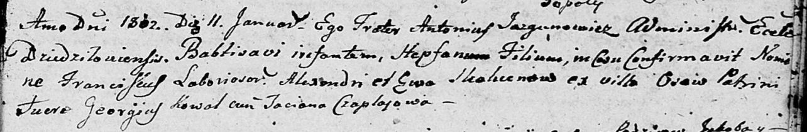

**Скакун Александр (Skakun Alexander)**

11 января 1802 г -- крещение сына Степана Франциска (НИАБ 136-13-894,
лист 46, №8/1802-р (ориг)).

**НИАБ 136-13-894:** Лист 46. **Метрическая запись №8/1802-р (ориг).**

{width="6.496527777777778in"
height="1.0674442257217849in"}

Дедиловичская Покровская церковь. 11 января 1802 года. Метрическая
запись о крещении.

Skakun Stepfan Franciscus -- сын селян с деревни Осовo.

Skakun Alexandr -- отец.

Skakunowa Ewa -- мать.

Kowal Georgius -- кум.

Czaplajowa Taciana -- кума.

Jazgunowicz Antonius -- ксёндз. (лат. язык)
