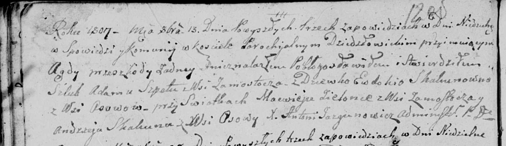

**Скакун Андрей (Skakun Andrzey)**

2 февраля 1805 г -- крещение сына Сымона Игнацыя (НИАБ 136-13-894, лист
56об, №14/1805-р (ориг)).

13 октября 1807 г -- свидетель венчания Адама Шпета с деревни Замосточье
с девкой Евдокией Скакун с деревни Осово

**НИАБ 136-13-894:** Лист 56об. **Метрическая запись №14/1805-р
(ориг).**

Дедиловичская Покровская церковь. 2 февраля 1805 года. Метрическая
запись о крещении.

Skakun Symon Jgnacy -- сын родителей с деревни Осовo.

Skakun Andrzey -- отец.

Skakunowa Nastazya -- мать.

Skakun Maciey -- кум, с деревни Осовo.

Kowalowa Zosia -- кума, с деревни Осовo.

Jazgunowicz Antoni -- ксёндз.

**НИАБ 136-13-920:** Лист 12об. **Метрическая запись №4/1807-б (ориг).**

Дедиловичская Покровская церковь. 13 октября 1807 года. Метрическая
запись о венчании.

Szpet Adam -- жених, с деревни Замосточье.

Skakunowna Ewdokia -- невеста, девка, с деревни Осовo.

Zielonka Macwiey -- свидетель, с деревни Замосточье.

Skakun Andrzey -- свидетель, с деревни Осовo.

Jazgunowicz Antoni -- ксёндз.
