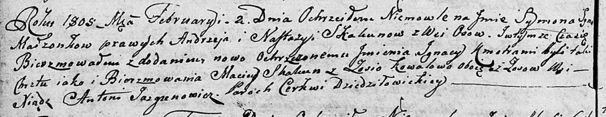

**Скакун Сымон Андреев (Skakun Symon Jgnacy)**

2 февраля 1805 г -- крещение (НИАБ 136-13-894, лист 56об, №14/1805-р
(ориг)).

**НИАБ 136-13-894:** Лист 56об. **Метрическая запись №14/1805-р
(ориг).**

{width="6.496527777777778in"
height="1.2605500874890638in"}

Дедиловичская Покровская церковь. 2 февраля 1805 года. Метрическая
запись о крещении.

Skakun Symon Jgnacy -- сын родителей с деревни Осовo.

Skakun Andrzey -- отец.

Skakunowa Nastazya -- мать.

Skakun Maciey -- кум, с деревни Осовo.

Kowalowa Zosia -- кума, с деревни Осовo.

Jazgunowicz Antoni -- ксёндз.
