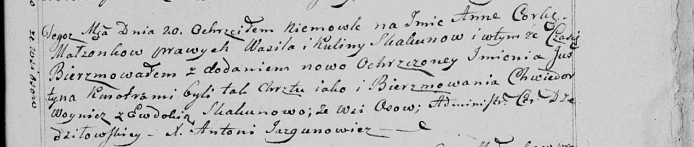

**Скакун Анна Василева младшая (Skakunowna Anna Justyna)**

20 августа 1799 г -- крещение дочери Анны Юстыны (НИАБ 136-13-894, лист
39об, №33/1799-р (ориг), (РГИА 823-2-18, лист 271, №32/1799-р (коп),
НИАБ 136-13-938, лист 243, №31/1799-р (коп).

**НИАБ 136-13-894:** Лист 39об. **Метрическая запись №33/1799-р
(ориг).**

{width="6.496527777777778in"
height="1.236411854768154in"}

Дедиловичская Покровская церковь. 20 августа 1799 года. Метрическая
запись о крещении.

Skakunowna Anna Justyna -- дочь родителей с деревни Осовo.

Skakun Wasil -- отец.

Skakunowa Kulina -- мать.

Woynicz Chwiedor -- кум.

Skakunowa Ewdokija -- кума.

Jazgunowicz Antoni -- ксёндз.

**РГИА 823-2-18:** Лист 271. **Метрическая запись №32/1799-р (коп).**

{width="6.496527777777778in"
height="2.48125in"}

Дедиловичская Покровская церковь. 20 августа 1799 года. Метрическая
запись о крещении.

Skakunowna Anna -- дочь родителей с деревни Осово.

Skakun Wasil -- отец.

Skakunowa Kulina -- мать.

Woynicz Chwiedor -- кум.

Skakunowa Ewdokia -- кума.

Jazgunowicz Antoni -- ксёндз.

**НИАБ 136-13-938:** Лист 243. **Метрическая запись №31/1799-р (коп).**

(См. тж. НИАБ 136-13-894, лист 39об, №33/1799-р (ориг); РГИА 823-2-18,
лист 271, №32/1799-р (коп))

{width="6.496527777777778in"
height="1.3791666666666667in"}

Дедиловичская Покровская церковь. 20 августа 1799 года. Метрическая
запись о крещении.

Skakunowna Anna Justyna -- дочь родителей с деревни Осово.

Skakun Wasil -- отец.

Skakunowa Kulina -- мать.

Woynicz Chwiedor -- кум.

Skakunowa Ewdokia - кума, с деревни Осово.

Jazgunowicz Antoni -- ксёндз.
