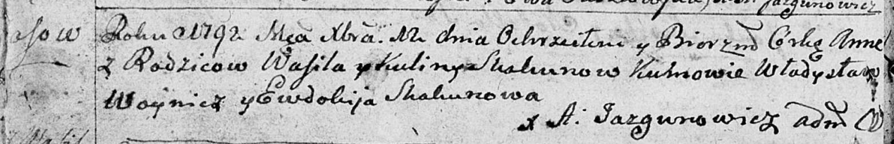
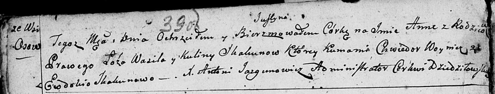
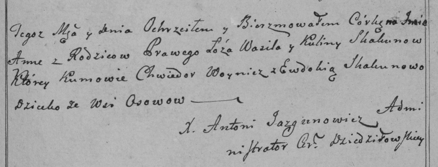
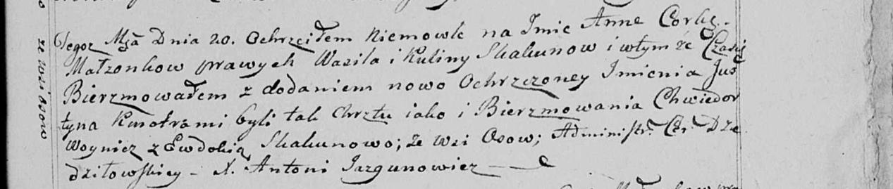
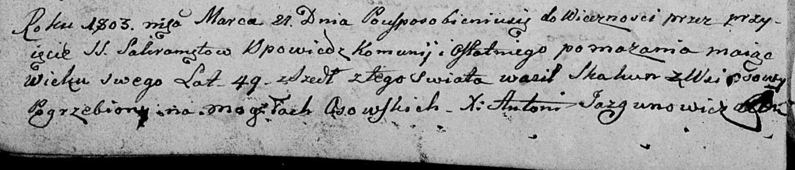

**Скакун Василь (Skakun Wasil)**

12 декабря 1792 г -- крещение дочери Анны (НИАБ 136-13-894, лист 17об,
№83/1792-р (ориг)), (РГИА 823-2-18, лист 245, №37/1792-р (коп)).

20 августа 1799 г -- крещение дочери Анны Юстыны (НИАБ 136-13-894, лист
39об, №33/1799-р (ориг), РГИА 823-2-18, лист 271, №32/1799-р (коп), НИАБ
136-13-938, лист 243, №31/1799-р (коп)).

21 марта 1803 г -- отпевание, умер в возрасте 49 лет (родился около 1754
г) (НИАБ 136-13-919, лист 13об, №4/1803-у (ориг)).

**НИАБ 136-13-894:** Лист 17-об. **Метрическая запись №83/1792-р
(ориг).**

Дедиловичская Покровская церковь. 12 декабря 1792 года. Метрическая
запись о крещении.

Skakunowna Anna -- родителей с деревни Осовo.

Skakun Wasil -- отец.

Skakunowa Kulina -- мать.

Woynicz Wladyslaw - кум.

Skakunowa Ewdokija - кума.

Jazgunowicz Antoni -- ксёндз.

**РГИА 823-2-18:** Лист 245об. **Метрическая запись №37/1792-р (коп).**

Дедиловичская Покровская церковь. 12 декабря 1792 года. Метрическая
запись о крещении.

Skakunowna Anna -- дочь родителей с деревни Осово.

Skakun Wasil -- отец.

Skakunowa Kulina -- мать.

Woynicz Władysław -- кум.

Skakunowa Eudokija -- кума.

Jazgunowicz Antoni -- ксёндз.

**НИАБ 136-13-894:** Лист 39об. **Метрическая запись №33/1799-р
(ориг).**

Дедиловичская Покровская церковь. 20 августа 1799 года. Метрическая
запись о крещении.

Skakunowna Anna Justyna -- дочь родителей с деревни Осовo.

Skakun Wasil -- отец.

Skakunowa Kulina -- мать.

Woynicz Chwiedor -- кум.

Skakunowa Ewdokija -- кума.

Jazgunowicz Antoni -- ксёндз.

**РГИА 823-2-18:** Лист 271. **Метрическая запись №32/1799-р (коп).**

Дедиловичская Покровская церковь. 20 августа 1799 года. Метрическая
запись о крещении.

Skakunowna Anna -- дочь родителей с деревни Осово.

Skakun Wasil -- отец.

Skakunowa Kulina -- мать.

Woynicz Chwiedor -- кум.

Skakunowa Ewdokia -- кума.

Jazgunowicz Antoni -- ксёндз.

**НИАБ 136-13-938:** Лист 243. **Метрическая запись №31/1799-р (коп).**

(См. тж. НИАБ 136-13-894, лист 39об, №33/1799-р (ориг); РГИА 823-2-18,
лист 271, №32/1799-р (коп))

Дедиловичская Покровская церковь. 20 августа 1799 года. Метрическая
запись о крещении.

Skakunowna Anna Justyna -- дочь родителей с деревни Осово.

Skakun Wasil -- отец.

Skakunowa Kulina -- мать.

Woynicz Chwiedor -- кум.

Skakunowa Ewdokia - кума, с деревни Осово.

Jazgunowicz Antoni -- ксёндз.

**НИАБ 136-13-919:** Лист 13об. **Метрическая запись №4/1803-у (ориг).**

Дедиловичская Покровская церковь. 21 марта 1803 года. Метрическая запись
об отпевании.

Skakun Wasil -- умерший, 49 лет, с деревни Осово, похоронен на кладбище
деревни Осово.

Jazgunowicz Antoni -- ксёндз.
