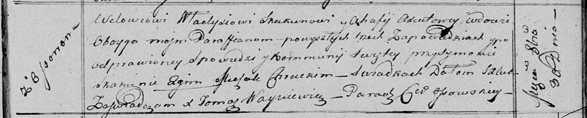
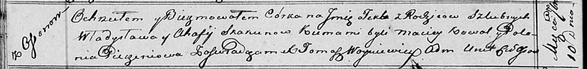

**Скакун (в предыдущем браке Аксюто) Агафия (Skakunowa (Axiutowa)
Ahafija)**

30 октября 1815 г -- венчание с вдовцом Владысём Скакуном с деревни
Осово (НИАБ 136-13-920, лист 22, №5/1815-б (ориг)).

10 сентября 1816 г -- крещение дочери Текли (НИАБ 136-13-894, лист 94об,
№31/1816-р (ориг)).

11 апреля 1820 г -- крещение дочери Хведоры (НИАБ 136-13-894, лист 104,
№10/1820-р (ориг)).

**НИАБ 136-13-920:** Лист 22. **Метрическая запись №5/1815-б (ориг).**

Осовская Покровская церковь. 30 октября 1815 года. Запись о венчании.

Skakun Władyś -- жених, вдовец, парафии Осовской, с деревни Осово.

Axiutowa Ahafija -- невеста, вдова, парафии Осовской.

Skakun Symon -- свидетель.

Chrucki Michał -- свидетель.

Woyniewicz Tomasz -- ксёндз.

**НИАБ 136-13-894:** Лист 94об. **Метрическая запись №31/1816-р
(ориг).**

Осовская Покровская церковь. 10 сентября 1816 года. Метрическая запись о
крещении.

Skakunowna Tekla -- дочь родителей с деревни Осовo.

Skakun Władysław -- отец.

Skakunowa Ahafija -- мать.

Kowal Maciej -- кум.

Pieczaniowa Polonia -- кума.

Woyniewicz Tomasz -- ксёндз.

**НИАБ 136-13-894:** Лист 104. **Метрическая запись №10/1820-р (ориг).**

Осовская Покровская церковь. 11 апреля 1820 года. Метрическая запись о
крещении.

Skakunowna Chwiedora -- дочь родителей с деревни Осовo.

Skakun Władyś -- отец.

Skakunowa Ahafija -- мать.

Kowal Maciey -- кум.

Pieczaniowa Połonia -- кума.

Woyniewicz Tomasz -- ксёндз.
