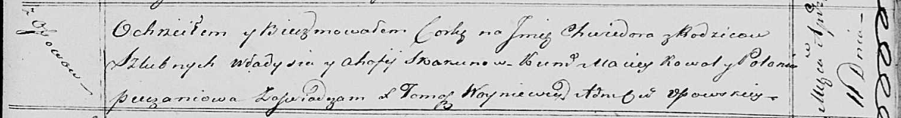

**Скакун Хведора Владыславова (Skakunowna Chwiedora)**

11 апреля 1820 г -- крещение (НИАБ 136-13-894, лист 104, №10/1820-р
(ориг)).

**НИАБ 136-13-894:** Лист 104. **Метрическая запись №10/1820-р (ориг).**

{width="6.496527777777778in"
height="0.8508716097987752in"}

Осовская Покровская церковь. 11 апреля 1820 года. Метрическая запись о
крещении.

Skakunowna Chwiedora -- дочь родителей с деревни Осовo.

Skakun Władyś -- отец.

Skakunowa Ahafija -- мать.

Kowal Maciey -- кум.

Pieczaniowa Połonia -- кума.

Woyniewicz Tomasz -- ксёндз.
