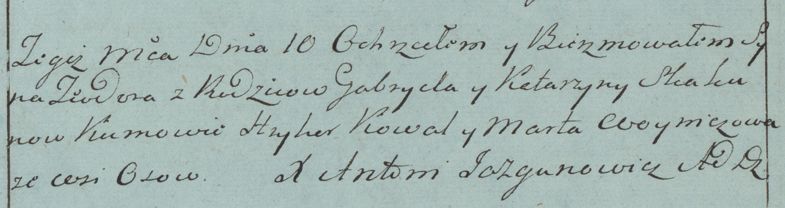

**Скакун Габриэль (Skakun Gabriel)**

10 февраля 1784 г -- крещение сына Тодора (РГИА 823-2-18, лист 226,
№5/1784-р (коп)).

**РГИА 823-2-18:** Лист 226. **Метрическая запись №5/1784-р (коп).**

Дедиловичская Покровская церковь. 10 февраля 1784 года. Метрическая
запись о крещении.

Skakun Teodor -- сын родителей с деревни Осово.

Skakun Gabriel -- отец.

Skakunowa Katarzyna -- мать.

Kawal Hryhor -- кум.

Woyniczowa Marta - кума.

Jazgunowicz Antoni -- ксёндз.
