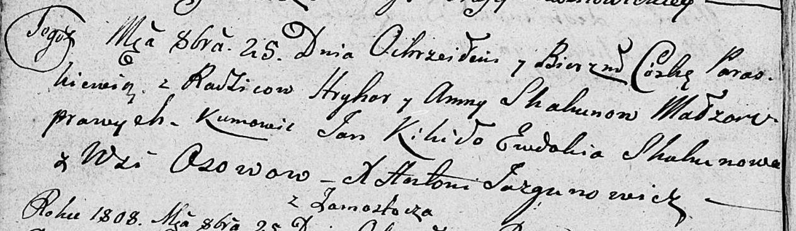

**Скакун Параскевия Грыгорова (Skakunowna Paraskewia)**

25 октября 1808 г -- крещение (НИАБ 136-13-894, лист 72об, №14/1808-р
(ориг)).

**НИАБ 136-13-894:** Лист 72об. **Метрическая запись №38/1808-р
(ориг).**

Дедиловичская Покровская церковь. 25 октября 1808 года. Метрическая
запись о крещении.

Skakunowna Paraskiewia -- дочь родителей с деревни Осово.

Skakun Hryhor -- отец.

Skakunowa Anna -- мать.

Kikiło Jan -- кум.

Skakunowa Ewdokia -- кума.

Jazgunowicz Antoni -- ксёндз.
