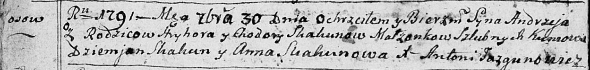

**Скакун Андрей Грыгоров (Skakun Andrzey)**

30 сентября 1791 г -- крещение (НИАБ 136-13-894, лист 14об, №64/1791-р
(ориг)).

Лист 14-об. **Метрическая запись №64/1791-р (ориг).**

Дедиловичская Покровская церковь. 30 сентября 1791 года. Метрическая
запись о крещении.

Skakun Andrzey -- сын родителей с деревни Осовo.

Skakun Hryhor -- отец.

Skakunowa Chodora -- мать.

Skakun Dziemjan - кум.

Skakunowa Anna - кума.

Jazgunowicz Antoni -- ксёндз.
