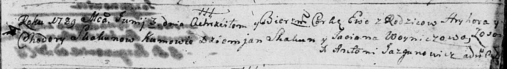

**Скакун Ева Грыгорова (Skakunowna Ewa)**

3 июня 1789 г -- крещение (НИАБ 136-13-894, лист 7, №28/1789-р (ориг)).

**НИАБ 136-13-894:** Лист 7. **Метрическая запись №28/1789-р (ориг).**

{width="6.496527777777778in"
height="0.88707895888014in"}

Дедиловичская Покровская церковь. 3 июня 1789 года. Метрическая запись о
крещении.

Skakunowna Ewa -- дочь родителей с деревни Осово.

Skakun Hryhor -- отец.

Skakunowa Chodora -- мать.

Skakun Dziemjan - кум.

Woyniczowa Taciana - кума.

Jazgunowicz Antoni -- ксёндз.
