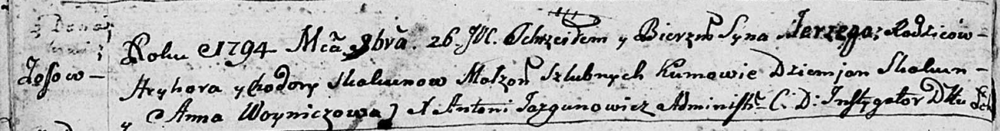

**Скакун Сергей Грыгоров (Skakun Jerzy)**

26 ноября 1794 г -- крещение (НИАБ 136-13-894, лист 23об, №57/1794-р
(ориг)), (РГИА 823-2-18, лист 251, №40/1794-р (коп)).

**НИАБ 136-13-894:** Лист 23об. **Метрическая запись №57/1794-р
(ориг).**

Дедиловичская Покровская церковь. 26 ноября 1794 года. Метрическая
запись о крещении.

Skakun Jerzy -- сын родителей с деревни Осовo.

Skakun Hryhor -- отец.

Skakunowa Chodora -- мать.

Skakun Dziemjan - кум.

Woyniczowa Anna - кума.

Jazgunowicz Antoni -- ксёндз.

**РГИА 823-2-18:** Лист 251. **Метрическая запись №40/1794-р (коп).**

Дедиловичская Покровская церковь. 26 ноября 1794 года. Метрическая
запись о крещении.

Skakun Jerzy -- сын родителей с деревни Осово.

Skakun Hryhor -- отец.

Skakunowa Chodora -- мать.

Skakun Dziemian -- кум.

Woyniczowa Anna -- кума.

Jazgunowicz Antoni -- ксёндз.
