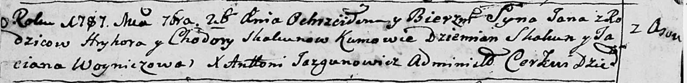
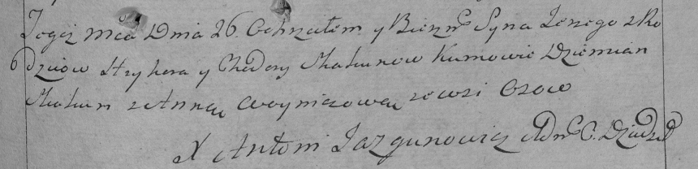

**Скакун Ходора (Skakunowa Chodora)**

26 сентября 1787 г -- крещение сына Яна (НИАБ 136-13-894, лист 2об,
№47/1787-р (ориг)).

3 июня 1789 г -- крещение дочери Евы (НИАБ 136-13-894, лист 7,
№28/1789-р (ориг)).

30 сентября 1791 г -- крещение сына Андрея (НИАБ 136-13-894, лист 14об,
№64/1791-р (ориг)).

26 ноября 1794 г -- крещение сына Сергея (НИАБ 136-13-894, лист 23об,
№57/1794-р (ориг)), (РГИА 823-2-18, лист 251, №40/1794-р (коп)).

**НИАБ 136-13-894:** Лист 2об. **Метрическая запись №47/1787-р (ориг).**

Дедиловичская Покровская церковь. 26 сентября 1787 года. Метрическая
запись о крещении.

Skakun Jan - сын родителей с деревни Осово.

Skakun Hryhor -- отец.

Skakunowa Chodora -- мать.

Skakun Dziemian - кум.

Woyniczowa Taciana - кума.

Jazgunowicz Antoni -- ксёндз.

**НИАБ 136-13-894:** Лист 7. **Метрическая запись №28/1789-р (ориг).**

Дедиловичская Покровская церковь. 3 июня 1789 года. Метрическая запись о
крещении.

Skakunowna Ewa -- дочь родителей с деревни Осово.

Skakun Hryhor -- отец.

Skakunowa Chodora -- мать.

Skakun Dziemjan - кум.

Woyniczowa Taciana - кума.

Jazgunowicz Antoni -- ксёндз.

Лист 14-об. **Метрическая запись №64/1791-р (ориг).**

Дедиловичская Покровская церковь. 30 сентября 1791 года. Метрическая
запись о крещении.

Skakun Andrzey -- сын родителей с деревни Осовo.

Skakun Hryhor -- отец.

Skakunowa Chodora -- мать.

Skakun Dziemjan - кум.

Skakunowa Anna - кума.

Jazgunowicz Antoni -- ксёндз.

**НИАБ 136-13-894:** Лист 23об. **Метрическая запись №57/1794-р
(ориг).**

Дедиловичская Покровская церковь. 26 ноября 1794 года. Метрическая
запись о крещении.

Skakun Jerzy -- сын родителей с деревни Осовo.

Skakun Hryhor -- отец.

Skakunowa Chodora -- мать.

Skakun Dziemjan - кум.

Woyniczowa Anna - кума.

Jazgunowicz Antoni -- ксёндз.

**РГИА 823-2-18:** Лист 251. **Метрическая запись №40/1794-р (коп).**

Дедиловичская Покровская церковь. 26 ноября 1794 года. Метрическая
запись о крещении.

Skakun Jerzy -- сын родителей с деревни Осово.

Skakun Hryhor -- отец.

Skakunowa Chodora -- мать.

Skakun Dziemian -- кум.

Woyniczowa Anna -- кума.

Jazgunowicz Antoni -- ксёндз.
