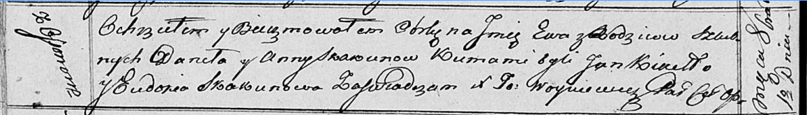

**Скакун Ева Данилова (Skakunowna Ewa)**

1 октября 1816 г -- крещение (НИАБ 136-13-894, лист 94об, №36/1816-р
(ориг)).

**НИАБ 136-13-894:** Лист 94об. **Метрическая запись №36/1816-р
(ориг).**

Осовская Покровская церковь. 1 октября 1816 года. Метрическая запись о
крещении.

Skakunowna Ewa -- дочь родителей с деревни Осовo.

Skakun Daniła -- отец.

Skakunowa Anna -- мать.

Kikiło Jan -- кум.

Skakunowa Eudokija -- кума.

Woyniewicz Tomasz -- ксёндз.
